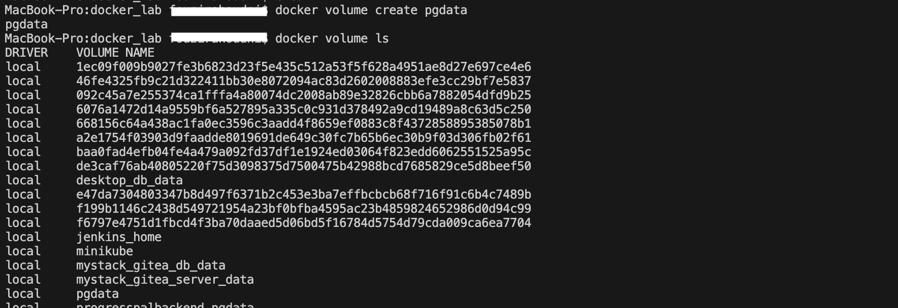
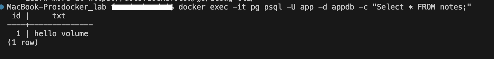
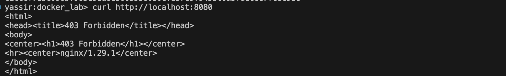

# 🐳 Lab 3 – Storage: Volumes vs Bind Mounts

## 🎯 Objectives
- Understand the difference between **Volumes** and **Bind Mounts**
- Persist database data using a **named volume**
- Live-edit website files using a **bind mount**
- Learn how to inspect, back up, and clean storage

---

## 🔎 Concepts

- **Volume**  
  - Managed by Docker (`docker volume ...`)  
  - Lives under Docker’s data dir (not your project folder)  
  - Best for **databases and persistent app data**  
  - Portable and safe across container rebuilds/removals

- **Bind Mount**  
  - Maps a **host folder** → **container path**  
  - Great for **development** (instant file changes)  
  - Uses absolute path (or `$PWD`); depends on your host FS

---

## Part A — Volumes with Postgres (Persistence)

### 1) Create a named volume
docker volume create pgdata
docker volume ls

### 2) Run Postgres with the volume
docker run -d --name pg \
  -e POSTGRES_USER=app \
  -e POSTGRES_PASSWORD=pass \
  -e POSTGRES_DB=appdb \
  -v pgdata:/var/lib/postgresql/data \
  -p 5432:5432 \
  postgres:16

  

### 3) Verify DB is reachable (optional inside container)
docker exec -it pg psql -U app -d appdb -c "CREATE TABLE notes(id serial primary key, txt text);"
docker exec -it pg psql -U app -d appdb -c "INSERT INTO notes(txt) VALUES ('hello volume');"
docker exec -it pg psql -U app -d appdb -c "SELECT * FROM notes;"

### 4) Prove persistence
docker rm -f pg
docker run -d --name pg \
  -e POSTGRES_USER=app \
  -e POSTGRES_PASSWORD=pass \
  -e POSTGRES_DB=appdb \
  -v pgdata:/var/lib/postgresql/data \
  -p 5432:5432 \
  postgres:16

# Your table & rows should still exist:
docker exec -it pg psql -U app -d appdb -c "SELECT * FROM notes;"

Takeaway: Data survives container removal because it lives in the pgdata volume.

### Part B — Bind Mounts with Nginx (Live Edits)
### 1) Create a site folder on host
mkdir -p site && printf "hi\n" > site/index.html

### 2) Run Nginx mapping the folder
docker run -d --name web \
  -p 8080:80 \
  -v "$PWD/site":/usr/share/nginx/html:ro \
  nginx:alpine

### 3) Test in browser / curl
curl http://localhost:8080
# => hi

### 4) Live-edit and refresh
printf "<h1>Hello, bind mount 🔥</h1>\n" > site/index.html
curl http://localhost:8080
# => updated HTML immediately

### Takeaway: Files you edit on your host appear instantly in the container.

🧰 Useful Inspections
# List volumes and see where they live
docker volume ls
docker volume inspect pgdata

# Inspect a running container’s mounts
docker inspect web | grep -A3 -n '"Mounts"'

🧑‍🍳 Bonus: Lightweight Backup of a Volume
# Create a tarball of the pgdata volume into your current folder
docker run --rm \
  -v pgdata:/data \
  -v "$PWD":/backup \
  alpine sh -lc "cd /data && tar czf /backup/pgdata-backup.tgz ."

# Restore example (stop DB first), then:
# docker run --rm -v pgdata:/data -v "$PWD":/backup \
#   alpine sh -lc "cd /data && tar xzf /backup/pgdata-backup.tgz"

### 🧹 Cleanup
docker rm -f web pg
docker volume rm pgdata

⚠️ docker volume rm deletes data. Use only if you’re sure.